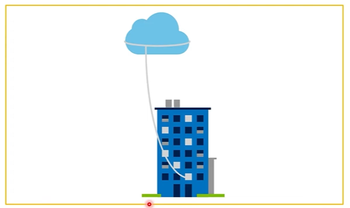
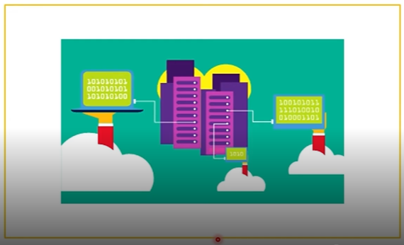
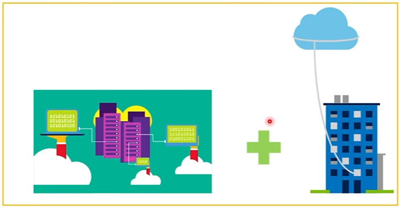
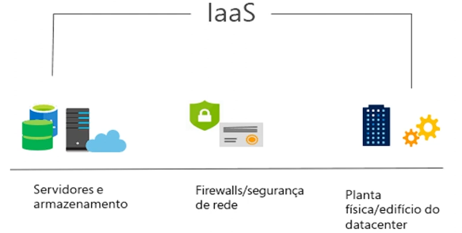
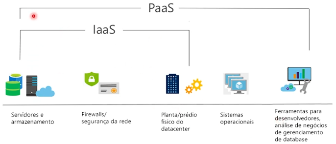
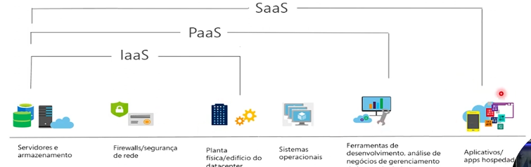

# Como a Computação em Nuvem Funciona

## Modelos de Implantação de Infraestrutura de TI

Este documento reúne conceitos e detalhes essenciais sobre **On-Premise**, **Computação em Nuvem** e **Modelo Híbrido**, para facilitar seus estudos e servir como material de consulta.

---

### 1. On-Premise (Infraestrutura Local)

**Descrição:**

- Infraestrutura de TI instalada e operada dentro das dependências da própria organização. Inclui servidores físicos, storage, redes, sistemas operacionais e software gerenciados internamente.

**Características Principais:**

- **Controle Total:** Hardware e software são de propriedade da empresa.
- **Propriedade de Dados:** Dados sensíveis armazenados localmente.
- **Modelos de Custo:** Principalmente CAPEX (investimento de capital) para aquisição de equipamentos.
- **Manutenção e Suporte:** Equipe interna responsável por atualizações, backup e segurança física.

**Vantagens:**

- Controle completo sobre configuração e políticas de segurança.
- Desempenho dedicado, sem latência de conexão externa.
- Indicado para requisitos regulatórios rígidos (LGPD, SOX, PCI-DSS).

**Desvantagens:**

- Alto investimento inicial e custos com depreciação de hardware.
- Escalabilidade limitada – expansão requer compra de novos equipamentos.
- Manutenção contínua e necessidade de equipe especializada.

**Exemplos de Uso:**

- Sistemas bancários críticos.
- Ambientes com dados de saúde protegidos (prontuários eletrônicos).
- Data centers corporativos para aplicações legadas.

**Quando Escolher:**

- Organizações com altos requisitos de conformidade e latência.
- Ambientes que demandam customizações intensivas de segurança.

---

### 2. Computação em Nuvem (Cloud)

**Descrição:**

- Infraestrutura de TI provida por provedores externos (AWS, Azure, Google Cloud, etc.), acessada pela internet em modelo de serviço.

**Modelos de Serviço (Eixos de Serviço):**

- **IaaS (Infrastructure as a Service):** Servidores, storage e redes virtualizados (ex.: Amazon EC2, Azure VM).
- **PaaS (Platform as a Service):** Plataforma gerenciada para desenvolvimento e deploy de aplicações (ex.: AWS Elastic Beanstalk, Azure App Service).
- **SaaS (Software as a Service):** Aplicações prontas para uso (ex.: Office 365, Salesforce).

**Características Principais:**

- **OPEX (Custo Operacional):** Pagamento conforme uso.
- **Elasticidade:** Escala automática de recursos.
- **Alta Disponibilidade:** SLA garantido pelo provedor.
- **Manutenção Delegada:** Provedor cuida de patching, hardware e segurança física.

**Vantagens:**

- Rápida implementação de novos ambientes.
- Escalabilidade on-demand e global.
- Redução de custo inicial e necessidade de equipe especializada.
- Acesso remoto de qualquer lugar com internet.

**Desvantagens:**

- Dependência de conexão de internet e latência variável.
- Exposição a riscos compartilhados de segurança.
- Custo total pode aumentar sem boa governança de recursos.
- Menor controle físico sobre a infraestrutura.

**Exemplos de Uso:**

- Aplicações web de alto tráfego.
- Testes e desenvolvimento (ambientes temporários).
- Serviços de big data, machine learning e analytics.

**Quando Escolher:**

- Projetos que demandam escalabilidade rápida.
- Startups ou equipes com orçamento inicial limitado.
- Aplicações distribuídas geograficamente.

---

### 3. Modelo Híbrido (Hybrid Cloud)

**Descrição:**

- Combinação de ambientes On-Premise e Cloud, integrados de forma orquestrada para atender diferentes necessidades.

**Arquitetura e Integração:**

- **Rede e Conectividade:** VPNs ou conexões dedicadas (ex.: AWS Direct Connect, Azure ExpressRoute).
- **Orquestração e Gerenciamento:** Ferramentas como VMware vRealize, Azure Arc ou Kubernetes multicloud.
- **Replicação de Dados:** Sincronização entre datacenter local e storage em nuvem.

**Vantagens:**

- Otimização de custos: cargas de trabalho flexíveis em nuvem e sistemas críticos locais.
- Resiliência: failover automático entre ambientes.
- Adoção gradual da nuvem, mantendo legado no local.
- Compliance seletiva: dados sensíveis ficam on-premise.

**Desvantagens:**

- Complexidade de gestão e governança mista.
- Integração e segurança entre ambientes exigem planejamento robusto.
- Custos adicionais com ferramentas de orquestração e conectividade dedicada.

**Exemplos de Uso:**

- Processamento de picos de demanda em nuvem mantendo bancos de dados principais internos.
- Backup e recuperação de desastre (DR) na nuvem.
- Ambientes de desenvolvimento/teste em nuvem, produção local.

**Melhores Práticas:**

- Definir claramente quais workloads ficam em cada ambiente.
- Implementar políticas de segurança unificadas (Identity Federation, IAM).
- Monitoramento centralizado e automação de deploy.

---

**Referência de Escolha**

| Critério | On-Premise | Cloud | Híbrido |
| --- | --- | --- | --- |
| Controle | Máximo | Moderado | Balanceado |
| Investimento (CAPEX) | Elevado | Baixo (OPEX) | Médio |
| Escalabilidade | Limitada | Alta | Alta |
| Flexibilidade | Baixa | Alta | Alta |
| Complexidade de Gestão | Média | Baixa | Alta |
| Compliance | Facilmente auditável | Compartilhada | Personalizável |

____________________________________________________________________________________________________________________________________________________________________________________________________________________________________________

## O que é a computação em nuvem ?

**Computação em nuvem** (ou **cloud computing**) é o modelo de disponibilização de recursos de TI (infraestrutura, plataformas e softwares) sob demanda pela internet, de forma escalável e paga conforme o uso. Em vez de adquirir e manter servidores, redes e licenças localmente, você “aluga” esses recursos de provedores especializados.

**On‑Demand & Self‑Service**

- Você provisiona recursos (VMs, armazenamento, bancos de dados) via portal ou API, sem precisar de intervenção humana do provedor.

## Nuvem Privada (Private Cloud)

### O que é?

A **nuvem privada** é um ambiente de computação em nuvem exclusivo para uma única organização. Pode ser hospedada **dentro da própria empresa (on-premise)** ou em data centers de terceiros, mas o acesso, gerenciamento e recursos são **restritos somente à organização proprietária**.

---

### Características

- **Isolamento Total:** Nenhum recurso é compartilhado com outras empresas.
- **Customização:** Mais flexibilidade para configurar a infraestrutura conforme requisitos específicos.
- **Controle Total:** A organização define e aplica suas próprias políticas de segurança, rede e desempenho.
- **Modelo Híbrido Possível:** Pode ser integrada com nuvem pública formando uma nuvem híbrida.
- As organizações crim um ambiente em nuvem em seu datacenter
- As organizações são responsáveis por operar os serviços que fornecem
- Não fornece acesso aos usuários fora da organizção
- Nenhuma despesa de capital para escalar verticalmente
- Os aplicativos podem ser provisionados e desprovisionados rapidamente

---

### Vantagens

| Vantagem | Explicação |
| --- | --- |
| **Segurança Reforçada** | Mais fácil aplicar normas rígidas de proteção de dados e compliance. |
| **Desempenho Consistente** | Recursos dedicados garantem performance previsível. |
| **Conformidade (Compliance)** | Facilita a adesão a leis como LGPD, HIPAA, etc. |
| **Controle Operacional** | Decisões sobre como, onde e quando usar os recursos são internas. |

---

### Desvantagens

| Desvantagem | Detalhes |
| --- | --- |
| **Custo Elevado** | Infraestrutura dedicada tem custo similar ao on-premise tradicional. |
| **Gerenciamento Complexo** | Requer equipe especializada ou contrato com MSPs (fornecedores gerenciados). |
| **Escalabilidade Limitada** | Crescimento depende da capacidade da estrutura dedicada. |

---

### Exemplos de uso

- **Bancos** que precisam manter dados de clientes com rigorosas regras de segurança.
- **Hospitais** que utilizam sistemas de prontuário eletrônico com alta confidencialidade.
- **Empresas com softwares legados** que não são compatíveis com a nuvem pública.

---

### 🔍 Quando usar?

- Quando a empresa precisa de alto controle sobre dados e infraestrutura.
- Quando há **exigência regulatória** que não pode ser atendida por uma nuvem pública.
- Quando o tráfego de dados interno é muito alto e precisa de baixa latência.

## Nuvem pública (Public Cloud)

### O que é?

A **nuvem pública** é um modelo de computação em nuvem onde **recursos como servidores, armazenamento e serviços são fornecidos por terceiros** (como AWS, Azure, Google Cloud) e **compartilhados entre vários clientes**, ainda que de forma isolada logicamente.

Esses recursos são acessados **pela internet** e cobrados geralmente **pelo uso (modelo OPEX)**.

---

### Características

- Pertecente a serviços de nuvem ou provedor de hosting.
- Fornece recursos e serviços a várias organizações e usuários.
- Acessada via conexão de rede segura (geralmente pela internet).
- **Alta Escalabilidade:** Recursos quase ilimitados disponíveis sob demanda.
- **Modelo sob Assinatura/Pagamento por Uso:** Você só paga pelo que usar.
- **Gerenciamento Terceirizado:** A manutenção da infraestrutura é responsabilidade do provedor.
- **Multiusuário (Multitenancy):** Diversos clientes usam a mesma infraestrutura, mas isoladamente.
- **Acesso Global:** Disponível em várias regiões do mundo com baixa latência.
- As organizações têm controle total sobre os recursos e a segurança
- As organizações são responáveis pela manutenção e pelas atualizações de hardware

---

### Vantagens

| Vantagem | Detalhes |
| --- | --- |
| **Baixo Custo Inicial** | Sem necessidade de comprar hardware ou manter data centers. |
| **Escalabilidade Flexível** | Cresce ou reduz recursos automaticamente, conforme a demanda. |
| **Inovação Rápida** | Facilita testes, protótipos e lançamentos com velocidade. |
| **Alto Desempenho e SLA** | Infraestrutura de ponta mantida por grandes empresas com alta disponibilidade. |

---

### Desvantagens

| Desvantagem | Detalhes |
| --- | --- |
| **Menor Controle Direto** | A infraestrutura física está sob responsabilidade do provedor. |
| **Possível Lock-in** | Dificuldade de migrar entre provedores por recursos específicos. |
| **Exigência de Internet Estável** | Necessita de boa conectividade para acessar os serviços. |
| **Segurança Compartilhada** | A responsabilidade é dividida entre provedor e cliente. |

---

### Exemplos de uso

- Hospedagem de **sites e aplicativos com picos de acesso**.
- Processos de **desenvolvimento e testes rápidos**.
- Armazenamento e **backup de arquivos** com custo otimizado.
- Execução de **machine learning, big data e análise preditiva**.

---

### Quando usar?

- Quando você precisa de **agilidade e escalabilidade**.
- Em **startups e empresas em crescimento**, com foco em custo-benefício.
- Para **projetos temporários ou variáveis**, onde o uso de recursos muda com frequência.
- Quando a manutenção e atualização da infraestrutura **não devem ser responsabilidades internas**.

---

## Nuvem Híbrida (Hybrid Cloud)

### O que é?

A **nuvem híbrida** é um modelo de infraestrutura que combina **ambientes de nuvem pública, nuvem privada e até on-premise** (infraestrutura local), permitindo que **dados e aplicações se movimentem entre eles** com integração e interoperabilidade.

Ela oferece o **melhor dos dois mundos**, equilibrando segurança, desempenho, escalabilidade e custo.

---

### Características

- **Integração entre ambientes distintos:** Os sistemas conversam entre si por meio de redes seguras, APIs e ferramentas de orquestração.
- **Flexibilidade Estratégica:** Recursos podem ser alocados de forma dinâmica onde for mais eficiente.
- **Balanceamento de Carga:** Permite distribuir demandas entre os ambientes para otimizar desempenho e custos.
- **Transição Suave:** Ideal para empresas que estão migrando gradualmente para a nuvem.
- As organizações determinam onde executar seus aplicativos.
- As organizações controlam a segurança, a conformidade e os requisitos legais.
- Fornece a maior flexibilidade

---

### Vantagens

| Vantagem | Explicação |
| --- | --- |
| **Flexibilidade Operacional** | Pode escolher onde rodar cada carga de trabalho, conforme necessidade. |
| **Custo Otimizado** | Dados sensíveis ficam na privada; operações dinâmicas vão para a pública. |
| **Continuidade de Negócios** | Possibilita recuperação de desastres e backups distribuídos. |
| **Migração Gradual** | Suporta empresas que estão adotando nuvem de forma progressiva. |

---

### Desvantagens

| Desvantagem | Detalhes |
| --- | --- |
| **Complexidade de Gerenciamento** | Exige ferramentas e profissionais para coordenar múltiplos ambientes. |
| **Integração Técnica Difícil** | Nem todos os sistemas se integram facilmente entre os ambientes. |
| **Custo de Integração Inicial** | Pode ter um custo alto no começo, especialmente com segurança e rede. |

---

### Exemplos de uso

- **Empresas que mantêm dados sensíveis em ambiente privado**, mas usam nuvem pública para aplicações web.
- **Indústrias com sistemas legados on-premise**, que se conectam a novas soluções em nuvem.
- **E-commerces**, que escalam seus servidores na nuvem pública em datas como Black Friday, mas mantêm os dados dos clientes em nuvem privada.

---

### Quando usar?

- Quando há **requisitos legais de proteção de dados**, mas também a necessidade de escalar rápido.
- Para **melhorar a resiliência e desempenho** dos sistemas.
- Em empresas que **já possuem uma infraestrutura própria** e querem modernizar sem perder o investimento feito.

---

## **CapEx (Capital Expenditure)** – Despesa de Capital

### O que é:

CapEx é o **gasto com aquisição de bens ou ativos de longo prazo**, usados por vários anos na empresa.

### Características:

- Gasto **grande feito de uma vez só** (investimento inicial alto).
- O gasto inicial de dinheiro  em infraestrutura física.
- As despeas do CapEx têm um valor que se reduz com o tempo.
- Gera **propriedade** sobre os ativos (servidores, data center etc.).
- Exige **planejamento financeiro a longo prazo**.
- Os ativos sofrem **depreciação** com o tempo.
- Manutenção e atualização são **responsabilidade da empresa**.

### Exemplos:

- Compra de servidores físicos.
- Construção de data center próprio.
- Compra de licenças permanentes de software.

## **OpEx (Operational Expenditure)** – Despesa Operacional

### O que é:

OpEx é o **gasto contínuo com serviços e operações do dia a dia**, geralmente pagos mensalmente ou conforme o uso.

### Características:

- **Custo menor e contínuo**, sem investimento inicial alto.
- Gastar com produtos e serviços conforme necessário, pagamento conforme o uso
- Seja cobrado imediatamente
- A empresa **não é dona do recurso**, apenas o utiliza.
- Alta **flexibilidade e escalabilidade**.
- A manutenção fica com o **fornecedor do serviço**.
- Ideal para **ambientes dinâmicos ou em crescimento**.

### Exemplos:

- Uso de servidores em nuvem (AWS, Azure).
- Assinatura mensal de software (SaaS).
- Contratação de serviços gerenciados.

---

## **Principais Diferenças**

| Aspecto | CapEx | OpEx |
| --- | --- | --- |
| Tipo de gasto | Investimento fixo (compra) | Custo operacional (aluguel/uso) |
| Pagamento | Alto custo inicial | Pagamento mensal ou por uso |
| Propriedade | A empresa é dona dos ativos | A empresa apenas usa os recursos |
| Escalabilidade | Difícil de escalar | Fácil de escalar rapidamente |
| Responsabilidade | Empresa mantém e atualiza | Fornecedor cuida da manutenção |
| Planejamento | Longo prazo | Curto e médio prazo |

_______________________________________________________________________________________________________________________________________________________________________________________________________________________________________

# Benefícios da Nuvem Azure

## Confiabilidade:

- Devido ao design descentralizado, a nuvem naturalmente dá suporte a uma infraestrutura confiável e resiliente.
- Com um desing descentraizado, a nuvem permite que você tenha recursos implantados em várias regiões do mundo.
- Com essa escala global, mesmo que ocorra um evento catastrófico em uma região, as outras regiões ainda estarão em funcionamento.

## Previsibilidade:

- A previsibilidade na nuvem permite que você avance com confiança, seja no desempenho ou no custo. Ambas são influenciadas pelo Microsoft Azure Well-Architected FrameWork.

## Segurança:

- A nuvem oferece ferramentas de segurança que atendem às necessidades dos clientes mas, é importante lembrar que a implemnetação de muitas delas devem ser realizadas pelo cliente.
- Se você quiser que a aplicação de patches e a manutenção sejam tratadas automaticamente, as implatações de plataforma como serviço ou software como serviços podem ser as melhores estratégias de nuvem para você.

## Governança:

- A auditoria baseada em nuvem ajuda a sinalizar qualquer recurso que esteja fora de conformidade com seus padrãos corporativos e fornece estratégias de mitigação.
- Dependendo do seu modelo operacional, patches de software e atualizações também podem ser aplicados automaticamente, o que ajuda na governança e na segurança
- Ao estabelecer uma presença de governança o mais cedo possível, você poderá manter sua presença de nuvem atualizada, protegida e bem gerenciada

## Gerenciabilidade:

- Um dos principais benefícios da computação em nuvem são as opções de capacidade de gerenciamento. Há dois tipos de capacidade de gerenciamento para computaçaõ em nuvem que você aprenderá nesta série e ambos trazem exelentes benefícios

**O gerenciamento da nuvem diz respeito a gerenciar seus recursos de nuvem. Por exemplo:**

- Escalar automaticamente a implantação de recursos com base na necessidade.
- Implantar recursos com base em um modelo pré-configurado, removendo a necessidade de configuração manual

**O gerenciamento na nuvem diz respeito à maneira de gerenciar seu ambiente de nuvem e seus recursps. Por exemplo:**

- Por meio de um portal da Web.
- Usando uma interface de linha de comando.
- Usando APIs.
- Usando o PowerShell

_____________________________________________________________________________________________________________________________________________________________________________________________________________________________________

# Tipos de Serviço de Nuvem na Azure

- IaaS, PaaS e SaaS

## IaaS ( Infraestrutura como serviço )

- **O que é:** Você aluga recursos de infraestrutura (servidores físicos ou virtuais, storage, redes e sistemas operacionais) de um provedor, pagando apenas pelo que usa.
- **Responsabilidade do usuário:** Gerenciar SO, middleware, runtimes, dados e aplicações.
- **Responsabilidade do provedor:** Hardware, virtualização, storage, rede e datacenter.
- **Quando usar:** Se você precisa de controle sobre o sistema operacional e middleware, mas não quer investir em data center próprio.
- Crie uma infraestrutura de TI de pagamento conforme o uso alugando servidores, máquinas virtuais, armazenamneto, redes e sistemas operacionais de um provedor de nuvem.

## Paas ( Plataforma como serviço )

- **O que é:** Fornece um ambiente completo para desenvolvimento, testes, deploy e gestão de aplicações sem que você precise cuidar da infraestrutura subjacente.
- **Responsabilidade do usuário:** Escrever e manter o código da aplicação e os dados.
- **Responsabilidade do provedor:** Infraestrutura, SO, middleware, runtimes, escalabilidade e patching.
- **Quando usar:** Se você quer focar apenas no desenvolvimento de software e acelerar ciclos de entrega, sem se preocupar com servidores ou redes.
- Fornece um ambiente para a criação, o teste e a implantação de aplicativos de software, sem focar no gerenciamneto da infraestrutura subjacente.

## SaaS ( software como serviço )

- **O que é:** Aplicações prontas, entregues pela internet. Você acessa via navegador ou app, sem instalar nada localmente.
- **Responsabilidade do usuário:** Consumir o serviço e gerenciar apenas as configurações de usuário e dados de negócio.
- **Responsabilidade do provedor:** Tudo, desde infraestrutura até aplicação, interface e segurança.
- **Quando usar:** Para soluções de produtividade (e‑mail, CRM, ERP) ou qualquer software que você queira consumir imediatamente, sem nenhum esforço operacional.
- Os usuários se conectam e usam aplicativos com base em nuvem pela internet: por exemplo, Microsoft Office 365, email e calendários

